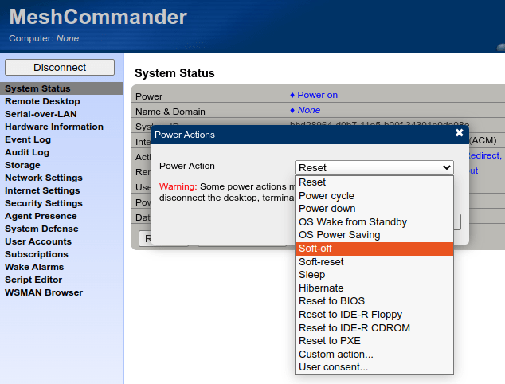

This has the [Intel LMS (Local Manageability Service)](https://github.com/intel/lms) binaries for:

* Debian 11
* Ubuntu 20.04
* Ubuntu 22.04

These are built in [rgl/lms](https://github.com/rgl/lms) by a [GitHub Actions workflow](https://github.com/rgl/lms/actions) and are [manually released to this repository](https://github.com/rgl/lms-binaries/releases).

# Usage

You can install this in Ubuntu 22.04 as:

```bash
wget https://github.com/rgl/lms-binaries/releases/download/v0.0.20220429/lms-2151.0.0-ubuntu-22.04.deb
dpkg-deb --info *.deb
dpkg-deb --contents *.deb
sudo apt-get install -y libace-7.0.6 libxerces-c3.2
sudo dpkg --install *.deb
sudo systemctl status lms
```

Watch the logs:

```bash
sudo journalctl --unit lms --follow
```

In MeshCommander, do a Graceful Shutdown/Reboot by choosing the `Soft-off`/`Soft-reset` Power Action:



The `lms` logs should show something alike:

```plain
Apr 29 08:19:00 vagrant LMS[16190]: Remote administrator shutdown request was executed
```

And the machine console should display a scheduled shutdown message alike:

```plain
Broadcast message from root@vagrant (Fri 2022-04-29 08:19:00 UTC):

The remote administrator has initiated a shutdown on this computer...
The system is going down for poweroff at Fri 2022-04-29 08:20:00 UTC!
```

And when the shutdown is actually done, the machine console should show something alike:

```plain
Broadcast message from root@vagrant (Fri 2022-04-29 08:20:00 UTC):

The remote administrator has initiated a shutdown on this computer...
The system is going down for poweroff NOW!
```

# References

* https://github.com/rgl/intel-amt-notes
* https://github.com/rgl/intel-amt-toggle-power-example
* https://github.com/rgl/lms
* https://github.com/intel/lms
